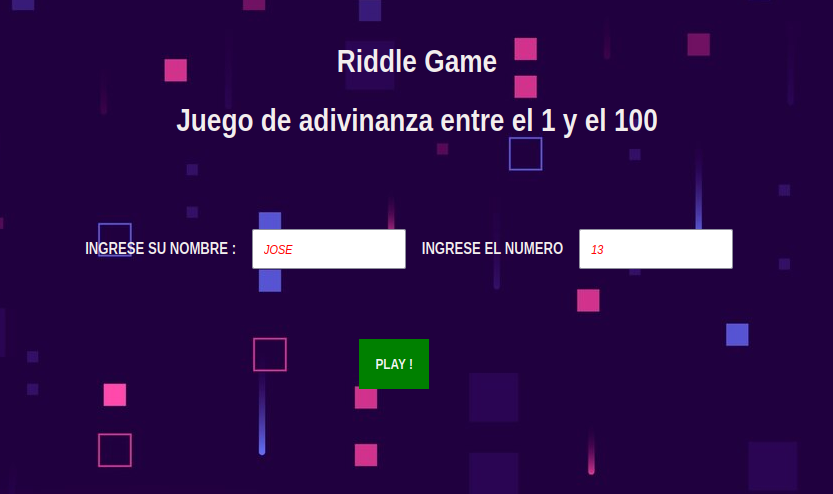
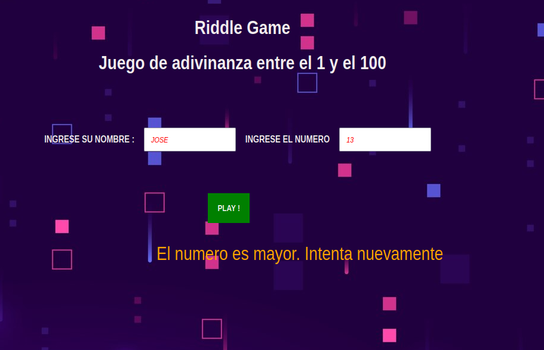
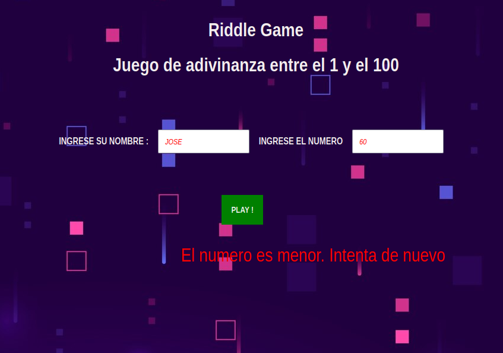
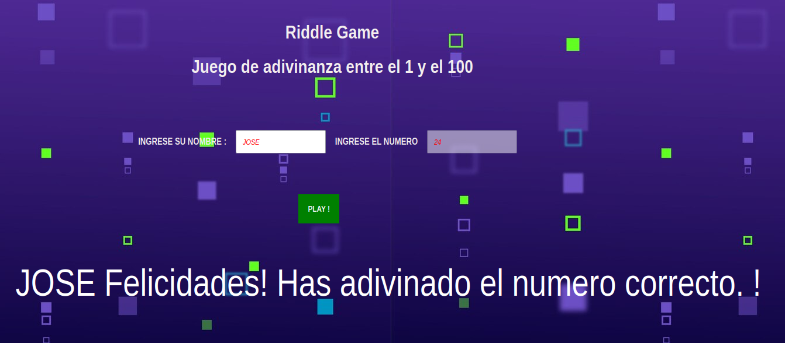

# Adivina el Número - Juego de Adivinanza

¡Bienvenido a **Adivina el Número**! Este es un simple juego en el que el jugador tiene que adivinar un número aleatorio entre 1 y 100.

## Descripción

Este proyecto es un juego de adivinanza en el que el programa selecciona un número al azar entre 1 y 100, y el jugador debe adivinarlo. Cada vez que el jugador ingresa un número, el programa le da pistas de si el número es más alto o más bajo que el número secreto, hasta que el jugador lo adivine correctamente.

## Características

- Generación aleatoria de un número entre 1 y 100.
- El juego indica si la adivinanza del jugador es demasiado alta o demasiado baja.
- El jugador puede intentar tantas veces como sea necesario para adivinar el número.
- Después de adivinar correctamente, el jugador puede optar por jugar de nuevo.

## Tecnologías utilizadas

- **HTML** - Interfaz de usuario básica para interactuar con el juego.
- **CSS** - Estilos simples para mejorar la presentación.
- **JavaScript** - Lógica del juego para generar el número aleatorio y evaluar las adivinanzas del jugador.

## Cómo jugar

1. Al iniciar el juego, se generará un número aleatorio entre 1 y 100.
2. El jugador deberá ingresar un número en el campo de entrada.
3. El programa le dirá si su número es demasiado alto, demasiado bajo o si ha acertado.
4. ¡Sigue adivinando hasta encontrar el número correcto!

## Instalación y configuración

Para jugar el juego localmente, sigue los siguientes pasos:

1. Clona el repositorio:
   ```bash
   git clone https://github.com/Jdavidaa01/riddleGame.git
`
# Capturas de pantala





# Autor
  David Avila - Jdavidaa01
